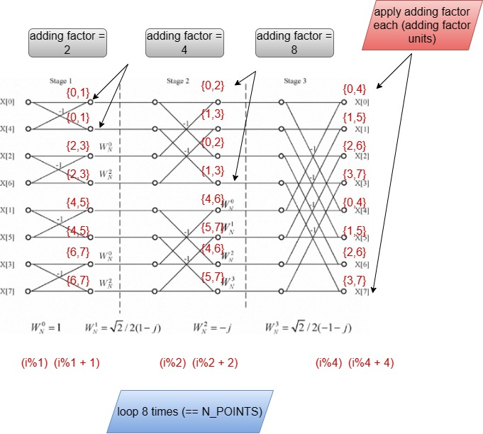

# FFT Core
Design of an fft core mainly used as a basis for ZKP algorithms.


# Block diagram


The bfu unit needs 3 elements to operate: -
* the first complex number (A).
* the second complex number (B).
* the twiddle factor (tw) (which is also a complex number).

The twiddle factor is pre-calculated for each stage and stored in the twiddle ROM. For each stage the inputs to the bfu unit (A, B) are stored in the first Memory and fed to the bfu unit, the generated results are stored in the second Memory. Then we move to the next stage. The input data are fed to the bfu from the second Memory and the generated results are stored in the first Memory. When we move to the next stage, we get the data from the first and store it in the second Memory...etc. 
When the operation is done and have passed by all the stages the `FFT_DONE` flag is asserted and the memory which contains the results are determined by the Controller. During the operation the `BUSY` flag is asserted. 

# Algorithm

Shown the butterfly graph for an 8-point FFT. the same algorithm holds for larger and smaller FFT blocks.


the indices for each 2 elements for the bfu are generated as follows: -

```c
    
    int adding_fact = 2 << STAGE_NUM;
    //
    // CODE
    //
    int mod_val = (n_points / 2) >> ((int)(log2(n_points)) - 1 - STAGE_NUM);
    int x_ind = i % mod_val + adding_fact;
    int y_ind = (i % mod_val + mod_val) + adding_fact;

```

# C golden model

```c
void new_fft(Complex_t *my_vect, int n_points)
{
    Complex_t tmp_inp[n_points];
    Complex_t tmp_out[n_points];

    for (int i = 0; i < n_points; i++)
    {
        tmp_inp[i] = my_vect[i];
        tmp_out[i].real = 0;
        tmp_out[i].img = 0;
    }
    

    for (int j = 0; j < log2(n_points); j++) // for each stage
    {
        int adding_fact_incr_val = 2 << j;
        int adding_fact = 0;

        printf("---- STAGE %d----\n", j);

        for (int i = 0; i < n_points; i++) // for each point
        {
            if ((i % adding_fact_incr_val == 0) && (i != 0))
                adding_fact = adding_fact + adding_fact_incr_val;
            int mod_val = (n_points >> 1) >> ((int)(log2(n_points)) - 1 - j);
            int x_ind = i % mod_val + adding_fact;
            int y_ind = (i % mod_val + mod_val) + adding_fact;
            int omega_super = i % adding_fact_incr_val;
            int omega_sub = adding_fact_incr_val;
            printf("{ %d , %d }  (omega_%d) ^ %d\n", x_ind, y_ind, omega_sub, omega_super);
            tmp_out[i] = bf_unit(tmp_inp[x_ind], tmp_inp[y_ind], tw_omega(omega_super, omega_sub));
        }

        for (int i = 0; i < n_points; i++)
        {
            tmp_inp[i] = tmp_out[i];
        }
        
    }

    for (int i = 0; i < n_points; i++)
    {
        my_vect[i] = tmp_out[i];
    }
    
}

```