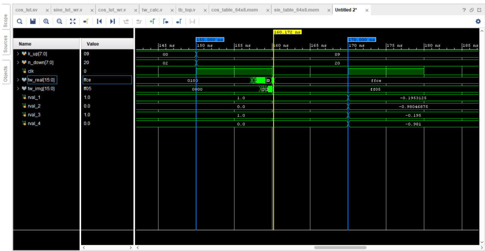

# Two project files
* one is the implementation of the BFU unit with fixed point representation on FPGA
* second is the implementation of TwiddleFactor on the fly calculation unit



```script
Vivado Simulator 2018.2
Time resolution is 1 ps
simtime: 50000,  (W_(  6))^(  8) =  R: 0.000      I: j 1.000 
simtime: 50000, ACTUAL C MODEL =  R: 0.000      I: j 1.000 
simtime: 90000,  (W_(  4))^( 16) =  R: 0.000      I: j -1.000 
simtime: 90000, ACTUAL C MODEL =  R: 0.000      I: j -1.000 
simtime: 130000,  (W_(  0))^(  2) =  R: 1.000      I: j 0.000 
simtime: 130000, ACTUAL C MODEL =  R: 1.000      I: j 0.000 
simtime: 170000,  (W_(  9))^( 32) =  R: -0.195      I: j -0.980 
simtime: 170000, ACTUAL C MODEL =  R: -0.195      I: j -0.981

```